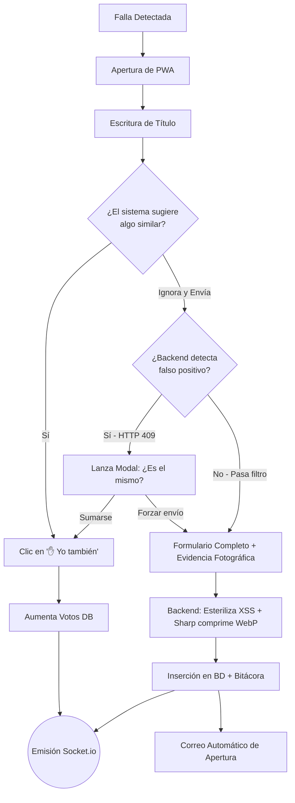
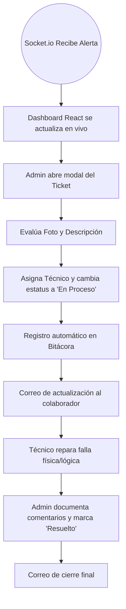

# 🎫 Tickets CANACO - Sistema de Mesa de Ayuda Interna
> Para el entorno oficial de producción y acceso remoto, se utiliza exclusivamente **Cloudflare Tunnels (Zero Trust)** apuntando al dominio `mantenimiento.canaco.net`. Queda **estrictamente deprecado el uso de ngrok** por políticas de seguridad corporativa y de infraestructura.

## 📋 Tabla de Contenidos

> **Destacado:** El sistema está construido como una **Progressive Web App (PWA)**, lo que permite a los colaboradores instalarlo directamente en sus celulares. En sus últimas actualizaciones, se implementó una arquitectura en **Tiempo Real (WebSockets)**, compresión de **Evidencias Visuales (WebP)**, gestión heurística de **Duplicados (HTTP 409)**, gestión de procesos con **PM2** y una barrera de **Seguridad Empresarial (Fase Búnker)** para proteger la integridad de los datos de CANACO.

- [Descripción General](#-descripción-general)
- [Arquitectura del Sistema](#-arquitectura-del-sistema)
- [Estrategia de Despliegue (Producción)](#-estrategia-de-despliegue-producción)
- [Características Principales](#-características-principales)
- [Seguridad y Protección (Fase Búnker)](#-seguridad-y-protección-fase-búnker)
- [Requisitos del Sistema](#-requisitos-del-sistema)
- [Instalación y Configuración](#-instalación-y-configuración)
- [Estructura del Proyecto](#-estructura-del-proyecto)
- [Esquema de Base de Datos](#-esquema-de-base-de-datos)
- [API Endpoints](#-api-endpoints)
- [Frontend y PWA](#-frontend-y-pwa)
- [Flujo de Trabajo Operativo](#-flujo-de-trabajo-operativo)
- [Mantenimiento y Control de Versiones](#-mantenimiento-y-control-de-versiones)
- [Soporte y Contacto](#-soporte-y-contacto)

---

## 🎯 Descripción General

**Tickets CANACO** es un sistema integral de Mesa de Ayuda (Help Desk) diseñado a la medida para centralizar, priorizar y gestionar eficientemente las incidencias, mantenimientos y reportes internos de la Cámara Nacional de Comercio (CANACO) de Monterrey. 

### Propósito y Objetivos
- **Centralización:** Unificar todos los reportes de fallas (Sistemas, Mantenimiento, Capital Humano, etc.) en un solo panel de control accesible desde cualquier dispositivo.
- **Reducción de Ruido:** Evitar la saturación de correos y mensajes duplicados agrupando problemas similares mediante un sistema inteligente de "votos" o "afectaciones" y validación backend de falsos positivos.
- **Comunicación Activa:** Mantener a los usuarios informados en tiempo real mediante actualizaciones dinámicas en pantalla (WebSockets) y notificaciones por correo electrónico transaccional.
- **Auditoría y Transparencia:** Proveer un panel administrativo robusto que permite controlar tiempos de respuesta, responsables, estatus, e incluye un registro inmutable (bitácora) de cada movimiento.

### Usuarios Objetivo y Roles
- **Administradores (Sistemas)**: Control total de la plataforma. Gestión de usuarios, asignación de técnicos, cambio de estatus, acceso a la bitácora de auditoría y descarga de reportes en Excel.
- **Técnicos**: Visualización enfocada en los tickets que les han sido asignados, con permisos para actualizar la resolución y agregar comentarios técnicos.
- **Colaboradores (Público General)**: Interfaz simplificada para la creación rápida de reportes sin necesidad de inicio de sesión, con capacidad de subir evidencia fotográfica y dar seguimiento a sus incidencias.

---

## 🏗️ Arquitectura del Sistema

La aplicación utiliza una arquitectura moderna basada en el stack PERN (PostgreSQL, Express, React, Node.js), vitaminada con conexiones bidireccionales y procesamiento en memoria.

```text
┌─────────────────┐    ┌─────────────────┐    ┌─────────────────┐
│                 │    │                 │    │                 │
│  Frontend (SPA) │◄──►│ Node.js Express │◄──►│   PostgreSQL    │
│  (React + Vite) │WSS │   (API + WSS)   │    │   (pg Pool)     │
│                 │    │                 │    │                 │
└─────────────────┘    └─────────────────┘    └─────────────────┘
        ▲                         ▲                       ▲
        │                         │                       │
        ▼                         ▼                       ▼
┌─────────────────┐    ┌─────────────────┐    ┌─────────────────┐
│  PWA Workbox,   │    │ Multer & Sharp  │    │ Middlewares JWT,│
│  Tailwind CSS & │    │ Nodemailer SMTP │    │ Helmet & RateLim│
│ Socket.io Client│    │                 │    │                 │
└─────────────────┘    └─────────────────┘    └─────────────────┘
```

### Stack Tecnológico
- **Backend**: Node.js, Express.js, Socket.io (WebSockets).
- **Frontend**: React.js (Vite), React Router Dom, Tailwind CSS, Recharts (Gráficas), XLSX (Exportación).
- **Base de Datos**: PostgreSQL (Conector `pg`).
- **Seguridad**: `helmet`, `express-rate-limit`, `dompurify` + `jsdom`, `jsonwebtoken` (JWT), `bcryptjs`.
- **Notificaciones**: `nodemailer` (SMTP con plantillas corporativas HTML).
- **Manejo de Archivos**: `multer` (Buffer en RAM) + `sharp` (Conversión a WebP y redimensionamiento).
- **PWA**: `vite-plugin-pwa` (Caché offline y Service Workers).
- **Infraestructura de Producción**: **PM2** (Gestor de procesos), **Cloudflare Tunnels / Connectors** (Acceso seguro y DNS), **Serve** (Servidor estático).

---

## 🚀 Estrategia de Despliegue (Producción)

Para el despliegue final en la laptop servidor de la oficina, se implementó una arquitectura de **Alta Disponibilidad** y **Modo Silencioso**:

### 1. Gestión de Procesos (PM2)
Se utiliza **PM2** para asegurar la persistencia del sistema. Los procesos se ejecutan en segundo plano y se reinician automáticamente ante fallos o reinicios de la laptop:
- **`api-canaco`**: Gestiona el backend y la conexión a la base de datos (puerto local 3000).
- **`web-canaco`**: Gestiona el frontend mediante el servidor de archivos estáticos (puerto local 5173).

### 2. Servidor de Producción (Build)
El frontend ya no utiliza el servidor de desarrollo pesado. Se genera una carpeta `/dist` mediante el comando de empaquetado `npm run build` y se sirve con la herramienta **Serve**, optimizando la velocidad de carga y reduciendo el consumo de RAM.

### 3. Modo Invisible en Windows
Se implementó un wrapper personalizado (`start-serve.js`) que utiliza la propiedad `windowsHide: true`. Esto permite que el servidor de producción funcione sin dejar ventanas de terminal abiertas en el escritorio del equipo servidor.

### 4. Túneles y DNS (Cloudflare Zero Trust)
- **Cloudflare Tunnels**: Proporciona una conexión SSL permanente y encriptada sin abrir puertos en el firewall local.
- Mapeos configurados: 
  - `mantenimiento.canaco.net` → `http://localhost:5173`
  - `api-mantenimiento.canaco.net` → `http://localhost:3000`

---

## ✨ Características Principales

### 📱 Experiencia de Usuario y Plataforma PWA
- **App Instalable**: Funciona como una aplicación nativa tanto en dispositivos móviles (iOS/Android) como en equipos de escritorio.
- **Tiempo Real Bidireccional**: La integración de WebSockets permite que los tableros, gráficas y notificaciones se actualicen automáticamente para todos los usuarios conectados sin necesidad de recargar la página.
- **Evidencia Visual Optimizada**: Integración directa con la cámara del dispositivo móvil. Las fotos subidas son interceptadas en la memoria RAM del servidor y convertidas al formato de nueva generación `WebP` mediante la librería `Sharp`, reduciendo drásticamente el peso del archivo sin perder calidad.
- **Gestión Masiva de Datos**: Implementación de paginación real procesada desde el motor de SQL (`LIMIT` y `OFFSET`) para manejar miles de registros sin degradar el rendimiento, junto con exportación de datos filtrados a Excel (`.xlsx`).

### 🧠 Inteligencia y Trazabilidad (Motor Anti-Duplicados)
- **Búsqueda Predictiva**: Un algoritmo sugiere tickets similares en tiempo real mientras el usuario teclea su reporte.
- **Validación Heurística de Backend (HTTP 409)**: Si un colaborador ignora las sugerencias e intenta enviar un ticket estructuralmente similar en la misma ubicación, el servidor rechaza la transacción (`409 Conflict`). El UI procesa el error y lanza un modal de decisión (Forzar creación vs. Sumarse al existente).
- **Sistema de Votación ("Yo también")**: Permite a otros colaboradores sumarse a una incidencia existente en lugar de generar un ticket nuevo, incrementando el contador de "afectados" y elevando la prioridad naturalmente.
- **Bitácora de Auditoría (Audit Log)**: Registro inmutable en base de datos de cada acción (quién cambió un estatus, cuándo se modificó la prioridad, qué comentarios se agregaron), garantizando transparencia absoluta.

### ✉️ Automatización de Flujos
- **Correos Transaccionales**: El sistema envía correos corporativos formateados en HTML en cada etapa clave: Creación del ticket, Actualización de estatus/comentarios, Resolución del problema y Cancelación.
- **Alertas Administrativas**: Si se genera un ticket "anónimo" (sin correo de contacto), el sistema alerta automáticamente a la mesa de ayuda para forzar un seguimiento presencial.

---

## 🛡️ Seguridad y Protección (Fase Búnker)

El sistema ha sido fortificado con estándares de seguridad a nivel empresarial para proteger los endpoints expuestos y los datos internos de CANACO:

1. **Rate Limiting Anti-Spam**: Implementación de `express-rate-limit` configurado para tolerar proxies inversos (Cloudflare). Limita el tráfico a 150 peticiones por IP cada 15 minutos, previniendo ataques de denegación de servicio (DDoS), scripts de fuerza bruta y spam masivo de tickets.
2. **Esterilización Anti-Veneno (XSS)**: Uso de `dompurify` junto con `jsdom` en el backend para limpiar y esterilizar todos los inputs del usuario (títulos, descripciones, comentarios). Esto neutraliza permanentemente cualquier inyección de código malicioso (`<script>`) antes de que toque la base de datos.
3. **Autenticación Estricta (JWT)**: Todos los endpoints administrativos están protegidos por validación de JSON Web Tokens. El frontend extrae y anexa el token criptográfico en los headers (`Authorization: Bearer`), impidiendo modificaciones directas mediante herramientas externas como Postman.
4. **Cabeceras Seguras**: Implementación de `helmet.js` para ocultar la firma del servidor Node.js y proteger contra vulnerabilidades comunes como Clickjacking y Sniffing de MIME types.

---

## 🚀 Instalación y Configuración

### 1. Clonar el Repositorio
```bash
git clone [https://github.com/tu-usuario/tickets_canaco.git](https://github.com/tu-usuario/tickets_canaco.git)
cd tickets_canaco
```

### 2. Configurar Base de Datos
Abre tu gestor de PostgreSQL y crea la base de datos principal:
```sql
CREATE DATABASE tickets_canaco;
```
*(Es indispensable aplicar los scripts completos encontrados en `backend/instrucciones_db.txt` que construyen las tablas relacionadas).*

### 3. Configurar Backend
```bash
cd backend
npm install
```
Crea el archivo `.env` en la raíz de la carpeta `backend`:
```env
PORT=3000
DB_USER=tu_usuario_pg
DB_PASSWORD=tu_password
DB_HOST=localhost
DB_PORT=5432
DB_NAME=tickets_canaco
JWT_SECRET=tu_secreto_super_seguro_y_largo
EMAIL_USER=helpdesk.canacomty@gmail.com
EMAIL_PASS=tu_app_password_de_google
```

### 4. Configurar Frontend y Empaquetar para Producción (Build)
```bash
cd frontend
npm install

# ⚠️ PASO CRÍTICO: Generar empaquetado optimizado estático
npm run build
```

### 5. Puesta en Marcha con PM2 (Modo Servidor)
Para iniciar el sistema de forma persistente e invisible en el servidor:
```bash
# Iniciar Backend
cd backend
pm2 start server.js --name "api-canaco"

# Iniciar Frontend (Usando el script de invisibilidad)
cd ../frontend
pm2 start start-serve.js --name "web-canaco"

# Configurar inicio automático con Windows
pm2-startup install
pm2 save
```

---

## 📁 Estructura del Proyecto

```text
TICKETS_CANACO/
├── backend/                    
│   ├── config/                 # Conexión persistente de DB y configuración de SMTP
│   ├── controllers/            # Lógica de negocio (authController, ticketController)
│   ├── middlewares/            # 🛡️ authMiddleware (Verificación JWT, Control de Roles)
│   ├── routes/                 # Enrutadores Express (API Endpoints)
│   ├── uploads/                # 📸 Almacenamiento local de evidencias (WebP)
│   ├── .env                    # Variables de entorno (Ignorado en Git)
│   └── server.js               # Entrypoint Principal (Express + Socket.io Server)
│
├── frontend/                   
│   ├── dist/                   # 📦 Archivos compilados para producción (Generado tras build)
│   ├── public/                 # Iconografía y archivo manifest.webmanifest (PWA)
│   ├── src/
│   │   ├── components/         # Componentes React (Forms, TicketCard, Charts)
│   │   ├── pages/              # Vistas principales (Tablero, Dashboard)
│   │   ├── services/           # Peticiones Fetch con inyección de JWT
│   │   └── config.js           # Variables globales (API_URL hacia canaco.net)
│   ├── start-serve.js          # 👻 Wrapper para ejecución invisible con PM2
│   └── vite.config.js          # Configuración del empaquetador y PWA
│
└── .gitignore                  # Reglas de exclusión para dependencias y binarios
```

---

## 🗄️ Esquema de Base de Datos

El sistema utiliza un esquema relacional normalizado en PostgreSQL. A continuación se presentan las estructuras principales.

### Tabla: `tickets` (Núcleo)
```sql
CREATE TABLE tickets (
    id SERIAL PRIMARY KEY,
    titulo VARCHAR(255) NOT NULL,
    descripcion TEXT NOT NULL,
    categoria VARCHAR(100),
    prioridad VARCHAR(50) DEFAULT 'media',
    ubicacion VARCHAR(255) NOT NULL,
    departamento VARCHAR(100),
    estatus VARCHAR(50) DEFAULT 'Abierto',
    nombre_contacto VARCHAR(255),
    email_contacto VARCHAR(255),
    evidencia VARCHAR(255), 
    votos INTEGER DEFAULT 0,
    usuario_id INTEGER REFERENCES usuarios(id),
    asignado_a INTEGER REFERENCES usuarios(id),
    comentarios TEXT,
    fecha_creacion TIMESTAMP DEFAULT CURRENT_TIMESTAMP,
    fecha_actualizacion TIMESTAMP DEFAULT CURRENT_TIMESTAMP,
    fecha_cierre TIMESTAMP
);
```

### Tabla: `bitacora_tickets` (Auditoría)
```sql
CREATE TABLE bitacora_tickets (
    id SERIAL PRIMARY KEY,
    ticket_id INTEGER REFERENCES tickets(id) ON DELETE CASCADE,
    usuario_id INTEGER REFERENCES usuarios(id) ON DELETE SET NULL,
    accion VARCHAR(100) NOT NULL,
    detalles TEXT,
    fecha TIMESTAMP DEFAULT CURRENT_TIMESTAMP
);
```

### Tabla: `votos_registro` (Anti-Duplicados)
```sql
CREATE TABLE votos_registro (
    ticket_id INTEGER REFERENCES tickets(id) ON DELETE CASCADE,
    usuario_id INTEGER REFERENCES usuarios(id) ON DELETE CASCADE,
    PRIMARY KEY (ticket_id, usuario_id)
);
```

---

## 🔌 API Endpoints

### Autenticación y Control de Usuarios
| Método | Endpoint | Descripción | Nivel de Acceso |
|--------|----------|-------------|-----------------|
| `POST` | `/auth/login` | Autenticación de usuario y generación JWT | 🌐 Público |
| `POST` | `/auth/register`| Creación de nuevas cuentas de empleado | 🌐 Público |
| `GET`  | `/auth/users` | Listar todos los usuarios y estatus | 🔒 Admin |
| `DELETE`| `/auth/users/:id`| Alternar estatus (Activar/Desactivar) | 🔒 Admin |

### Gestión Operativa de Tickets
| Método | Endpoint | Descripción | Nivel de Acceso |
|--------|----------|-------------|-----------------|
| `GET`  | `/tickets` | Obtiene lista completa (Soporta paginación SQL) | 🌐 Público |
| `POST` | `/tickets` | Multipart FormData. Valida heurística de duplicados (Retorna `200 OK` o `409 Conflict`). Soporta bandera explícita `ignorarDuplicado=true` | 🌐 Público |
| `GET`  | `/tickets/buscar?q=` | Búsqueda predictiva (Filtrado XSS) | 🌐 Público |
| `PUT`  | `/tickets/:id` | Actualización de estatus/prioridad + Bitácora | 🔒 Admin/Técnico |
| `POST` | `/tickets/:id/vote`| Incrementa contador de afectaciones | 🌐 Público |
| `DELETE`|`/tickets/:id` | Eliminación definitiva + Alerta WSS | 🔒 Admin |
| `GET`  |`/tickets/:id/bitacora`| Retorna el historial inmutable de cambios | 🔒 Admin/Técnico |

---

## 🔄 Flujo de Trabajo Operativo

### 1. Detección, Reporte y Control de Falsos Positivos


### 2. Gestión y Resolución (Sistemas / Admin)


---

## 🛠️ Mantenimiento y Control de Versiones

Para asegurar la salud del repositorio remoto, es estricto mantener el archivo `.gitignore` configurado de la siguiente manera:

```text
node_modules/
backend/node_modules/
frontend/node_modules/
.env
backend/.env
frontend/dist/
frontend/dev-dist/
backend/uploads/
```

### Comandos Críticos de PM2 en el Servidor
- **Ver estado:** `pm2 status`
- **Ver actividad y errores:** `pm2 logs`
- **Reiniciar servicios (Post-Actualización):** `pm2 restart all`
- **Guardar configuración en arranque:** `pm2 save`

---

## 📞 Soporte y Contacto

- **Desarrollador Principal**: Cristian Alejandro
- **Rol y Perfil**: Ingeniero en Desarrollo y Gestión de Software
- **Departamento**: Sistemas
- **Organización**: Cámara Nacional de Comercio (CANACO) Monterrey
- **Contacto**: helpdesk.canacomty@gmail.com