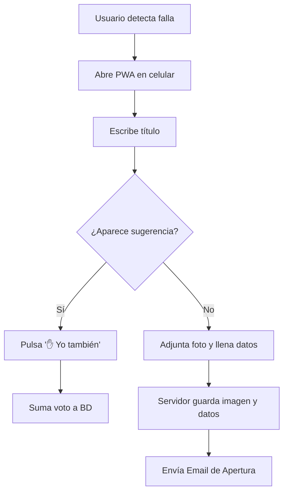
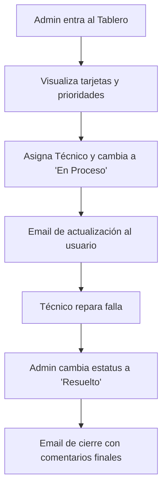

# 🎫 Tickets CANACO - Sistema de Mesa de Ayuda Interna
> Para desarrollo colaborativo en vivo o acceso remoto, se utiliza **ngrok** apuntando al puerto del frontend (5173).

## 📋 Tabla de Contenidos

> **Destacado:** El sistema está construido como una **Progressive Web App (PWA)**, lo que permite a los colaboradores instalarlo directamente en sus celulares. Recientemente se implementó la subida de **Evidencias Visuales** mediante `Multer`, permitiendo tomar fotos desde la cámara del celular o subir archivos, los cuales son gestionados y blindados directamente en el servidor.

- [Descripción General](#-descripción-general)
- [Arquitectura del Sistema](#-arquitectura-del-sistema)
- [Características Principales](#-características-principales)
- [Requisitos del Sistema](#-requisitos-del-sistema)
- [Instalación y Configuración](#-instalación-y-configuración)
- [Estructura del Proyecto](#-estructura-del-proyecto)
- [Base de Datos](#-base-de-datos)
- [API Endpoints](#-api-endpoints)
- [Frontend](#-frontend)
- [Flujo de Trabajo](#-flujo-de-trabajo)
- [Mantenimiento y Git](#-mantenimiento-y-git)

## 🎯 Descripción General

**Tickets CANACO** es un sistema integral de Mesa de Ayuda (Help Desk) diseñado para centralizar, priorizar y gestionar las incidencias y reportes internos de la Cámara Nacional de Comercio (CANACO) de Monterrey. 

### Propósito
- Centralizar todos los reportes de fallas (Sistemas, Mantenimiento, etc.) en un solo lugar.
- Evitar la saturación de mensajes agrupando problemas similares mediante un sistema de "votos".
- Mantener a los usuarios informados en tiempo real mediante correos electrónicos automáticos.
- Proveer un panel administrativo para controlar tiempos de respuesta, responsables y estatus.

### Usuarios Objetivo
- **Administradores / Sistemas**: Gestión completa, asignación de técnicos, cambio de estatus y prioridades.
- **Técnicos**: Visualización de tickets asignados y actualización de resolución.
- **Colaboradores (Público)**: Creación rápida de reportes sin necesidad de inicio de sesión, y seguimiento de incidencias.

## 🏗️ Arquitectura del Sistema

```text
┌─────────────────┐    ┌─────────────────┐    ┌─────────────────┐
│                 │    │                 │    │                 │
│  Frontend (SPA) │◄──►│ Node.js Express │◄──►│   PostgreSQL    │
│  (React + Vite) │    │   (API REST)    │    │   (pg Pool)     │
│                 │    │                 │    │                 │
└─────────────────┘    └─────────────────┘    └─────────────────┘
        ▲                        ▲                      ▲
        │                        │                      │
        ▼                        ▼                      ▼
┌─────────────────┐    ┌─────────────────┐    ┌─────────────────┐
│  PWA Workbox &  │    │ Multer (Fotos) &│    │ Relaciones y    │
│  Tailwind CSS   │    │ Nodemailer SMTP │    │ Almacenamiento  │
└─────────────────┘    └─────────────────┘    └─────────────────┘
```

### Tecnologías Utilizadas
- **Backend**: Node.js, Express.js
- **Frontend**: React.js (Vite), React Router Dom
- **Base de Datos**: PostgreSQL (conector `pg`)
- **Autenticación**: `bcryptjs` (soporte híbrido para contraseñas legacy)
- **Notificaciones**: `nodemailer` (Plantillas corporativas HTML)
- **Manejo de Archivos**: `multer` (Evidencias fotográficas)
- **Estilos**: Tailwind CSS
- **PWA**: `vite-plugin-pwa`

## ✨ Características Principales

### 📱 Experiencia de Usuario y PWA
- **Instalable**: Funciona como app nativa en dispositivos móviles y de escritorio.
- **Evidencia Visual**: Captura directa desde la cámara del celular o subida de imágenes.
- **Interfaz Reactiva**: Actualizaciones y filtros de búsqueda sin recargar la página.

### 🧠 Prevención de Duplicados
- **Búsqueda Predictiva**: Sugiere tickets similares en tiempo real.
- **Sistema de Votación**: El usuario pulsa "✋ Yo también" en lugar de crear un reporte duplicado.

### ✉️ Automatización
- **Correos Transaccionales**: Envío automático de correos (Apertura, Actualización, Resolución).
- **Alertas de Seguridad**: Si un usuario crea un reporte anónimo, se alerta al administrador.

## 🚀 Instalación y Configuración

### 1. Clonar el Repositorio
```bash
git clone [https://github.com/tu-usuario/tickets_canaco.git](https://github.com/tu-usuario/tickets_canaco.git)
cd tickets_canaco
```

### 2. Configurar Base de Datos
Abre tu gestor de PostgreSQL y crea la base de datos:
```sql
CREATE DATABASE tickets_canaco;
```
*(Aplica los scripts encontrados en `backend/instrucciones_db.txt`)*

### 3. Configurar Backend
```bash
cd backend
npm install
```
Crea el archivo `.env` en la carpeta backend:
```env
PORT=3000
DB_USER=tu_usuario_pg
DB_PASSWORD=tu_password
DB_HOST=localhost
DB_PORT=5432
DB_NAME=tickets_canaco
EMAIL_USER=helpdesk.canacomty@gmail.com
EMAIL_PASS=tu_app_password
```
Inicia el servidor:
```bash
npm run dev
```

### 4. Configurar Frontend
En una nueva terminal:
```bash
cd frontend
npm install
npm run dev
```

### 5. Acceso Remoto desde Celular (ngrok)
Para que tú o los técnicos puedan probar la subida de fotos y el sistema en vivo desde el celular, abre una **tercera terminal** y ejecuta:
```bash
ngrok http 5173
```
*(Copia el enlace `https://...` que dice **Forwarding** y ábrelo en el navegador de tu celular).*

## 📁 Estructura del Proyecto

```text
TICKETS_CANACO/
├── backend/                    
│   ├── config/                 # Conexión DB y Nodemailer
│   ├── controllers/            # authController, ticketController
│   ├── routes/                 # Endpoints
│   ├── uploads/                # 📸 Almacenamiento local de evidencias
│   ├── .env                    # Variables de entorno
│   └── server.js               # Entrypoint Express
│
├── frontend/                   
│   ├── public/                 # Iconos y manifest PWA
│   ├── src/
│   │   ├── components/         # Formularios, Tarjetas
│   │   ├── pages/              # Tablero, Login, Registro
│   │   ├── services/           # Peticiones Fetch (ticketService.js)
│   │   └── config.js           # API_URL
│   └── vite.config.js          # Vite, Proxy y Workbox (PWA)
│
└── .gitignore                  # Exclusión de Node_modules y Uploads
```

## 🗄️ Base de Datos

### Tabla Principal: `tickets`
```sql
CREATE TABLE tickets (
    id SERIAL PRIMARY KEY,
    titulo VARCHAR(255) NOT NULL,
    descripcion TEXT NOT NULL,
    categoria VARCHAR(100),
    prioridad VARCHAR(50) DEFAULT 'baja',
    ubicacion VARCHAR(255) NOT NULL,
    departamento VARCHAR(100),
    estatus VARCHAR(50) DEFAULT 'Abierto',
    nombre_contacto VARCHAR(255),
    email_contacto VARCHAR(255),
    evidencia VARCHAR(255), 
    votos INTEGER DEFAULT 0,
    usuario_id INTEGER REFERENCES usuarios(id),
    asignado_a INTEGER REFERENCES usuarios(id),
    comentarios TEXT,
    fecha_creacion TIMESTAMP DEFAULT CURRENT_TIMESTAMP,
    fecha_actualizacion TIMESTAMP DEFAULT CURRENT_TIMESTAMP,
    fecha_cierre TIMESTAMP
);
```

## 🔌 API Endpoints

### Autenticación
| Método | Endpoint | Descripción |
|--------|----------|-------------|
| `POST` | `/auth/login` | Autenticación híbrida |
| `POST` | `/auth/register`| Creación de cuentas |
| `GET`  | `/auth/users` | Listar usuarios |

### Gestión de Tickets
| Método | Endpoint | Descripción |
|--------|----------|-------------|
| `GET`  | `/tickets` | Lista completa de tickets |
| `POST` | `/tickets` | **(FormData)** Crea ticket + sube foto + Correo |
| `GET`  | `/tickets/buscar?q=` | Búsqueda predictiva |
| `PUT`  | `/tickets/:id` | Actualiza estatus/prioridad + Correo |
| `POST` | `/tickets/:id/vote`| Incrementa afectaciones |
| `DELETE`|`/tickets/:id` | Borra ticket + Alerta |

## 🎨 Frontend

### Integración de Evidencias (FormData)
Para enviar archivos e imágenes al backend:
```javascript
export const createTicket = async (ticketData) => {
  const formData = new FormData();
  for (const key in ticketData) {
    if (ticketData[key]) formData.append(key, ticketData[key]);
  }
  const response = await fetch(`${API_URL}/tickets`, {
    method: 'POST',
    body: formData, 
  });
  return await response.json();
};
```

### Configuración PWA (Workbox)
El archivo `vite.config.js` excluye explícitamente la ruta de las fotos para evitar el bloqueo offline:
```javascript
workbox: {
  navigateFallbackDenylist: [/^\/uploads/] 
}
```

## 🔄 Flujo de Trabajo

### 1. Reporte de Incidencia


### 2. Gestión Administrativa


## 🛠️ Mantenimiento y Git

Mantener el `.gitignore` configurado para evitar saturar el repositorio:
```text
node_modules/
backend/node_modules/
frontend/node_modules/
.env
backend/.env
frontend/dist/
frontend/dev-dist/
backend/uploads/
```
*Las imágenes en `/uploads` NO deben subirse al repositorio en la nube.*

---

## 📞 Soporte y Contacto

- **Desarrollador**: Cristian Alejandro
- **Rol**: Estudiante de Desarrollo y Gestión de Software / Mantenimiento de Sistemas
- **Departamento**: Sistemas (CANACO Monterrey)